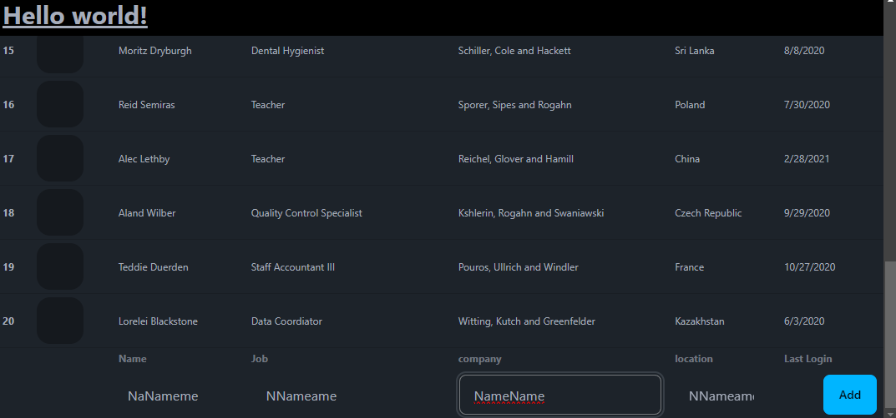

# The task description
**Формулировка**: \
Необходимо реализовать модель таблицы, в которую можно вносить данные. \
**Требования**: 
- Таблица должна иметь изменяемый размер столбцов.
- Таблица должна иметь возможность сортировки по возрастанию и убыванию по каждому столбцу.
- Таблица должна иметь поле для поиска совпадений (значение содержит вводимую \ строку) по каждому столбцу и одно поле для поиска по всем столбцам сразу.
- Необходимо добавить возможность скрывать/показывать столбцы через интерфейс пользователя.

- Таблица должна являться javascript объектом/классом. 
- Добавление/ Удаление колонок нужно реализовать через функцию объекта/класса.
- Добавление/ Удаление строк нужно реализовать через функцию объекта/класса.
- Необходимо реализовать функцию для загрузки данных в таблицу из json файла.
- Необходимо реализовать функцию для выгрузки данных из таблицы в json файл.
- Возможны следующие типы для колонок: number, string, boolean.

Данный функционал необходимо реализовать на javascript или ReactJS без использования дополнительных библиотек. \
Визуальную часть реализовать по своему усмотрению, спорные моменты по дизайну также по своему усмотрению.

## О работе
- [Front развернут](https://tryd0g0lik.github.io/test-table/) на `github-pages`
- Backend на внешнем сервере.
Открывая фронт подождите 50 секундю Время для запуска сервера.

Вся логика писалась с целью создать код как можно больше динамичным и как можно меньше статичных данных \ 
Например для реаллизации той же технологии dnd в дальнейшем.

### Казус
Первая загрузка данныз на страницу реализована [через Redux](https://github.com/Tryd0g0lik/test-table/tree/master/src/frontend/src/reduxs). \
Казус в том, что при первичной загрузки страницы логика срабатывает быстрее, запускается внешний сервер. Поэтому страница кажется пустой.
Спустя 50 секунд работают [добавление](https://github.com/Tryd0g0lik/test-table/blob/8b46e01fbd47e616cd9f5de6f49a45685358c86c/src/backend/src/server.js#L21-L40)/[удаление](https://github.com/Tryd0g0lik/test-table/blob/8b46e01fbd47e616cd9f5de6f49a45685358c86c/src/backend/src/server.js#L86-L101) данных на сервер. \
В локальном режиме работает все сразу.

### О главном
К сожалению - добавить / удалить и первичная заггрузка это все что сделано. \
Поетерял больше одного дня из-за флага `-w` в модуле `forever`, хотя логика реализации не выполненой работы прекрасно имеется. \
Как бы не было печально - что есть, то есть.

## Stack 
- NodeJS
- TS
- React
- Redux
- webpack
- daisyui
- tailwindcss

- [Backend](https://github.com/Tryd0g0lik/test-table/tree/master/src/backend)
- [Frontend](https://github.com/Tryd0g0lik/test-table/tree/master/src/frontend)

## Command 

 - `server:front` this's  start wark for a local [server of front](https://github.com/Tryd0g0lik/test-table/blob/8b46e01fbd47e616cd9f5de6f49a45685358c86c/package.json#L14);
 - `cssstyle` here styles of out framework. This [command is a runs styles](https://github.com/Tryd0g0lik/test-table/blob/8b46e01fbd47e616cd9f5de6f49a45685358c86c/package.json#L17) for local developmentж
 - `watchs` [run the `server.js'](https://github.com/Tryd0g0lik/test-table/blob/8b46e01fbd47e616cd9f5de6f49a45685358c86c/package.json#L19) of backend
 
## History
- [master]: github's root;
- [1]: Beginning works. Here a htaml table and datas backend was added ;
- [2.1]: redux was added and fixed function ADD and REMOVE was; 

## View

